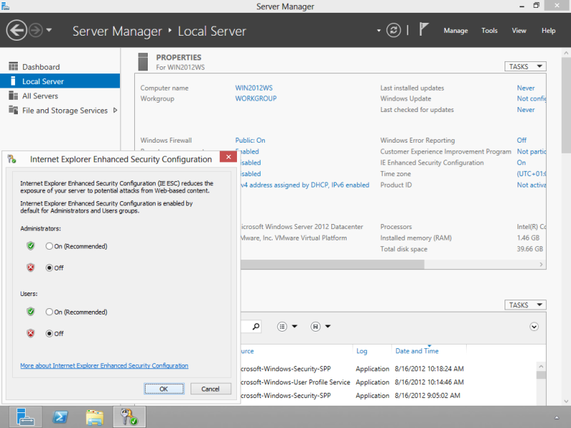

*Copy of a win2012workstation.com [post](http://www.win2012workstation.com/ie-enhanced-security-configuration/)*

# Disable the IE Enhanced Security Configuration

## Internet Explorer Enhanced Security Configuration

By default, Windows Server 2012 protects against attacks via the browser by greatly limiting the browsers’ possibilities. This is useful for servers, however if you want to use it for normal web browsing, it is desired to turn this security feature off.

To turn this feature off, open the `Server Manager`, select `Local Server` in the left pane and click at the `On` link behind the `IE Enhanced Configuration` setting in the `PROPERTIES` section. Next, switch the setting to `Off` for both Administrators and Users to disable it for both user groups. Save the changed values by clicking `OK`.

