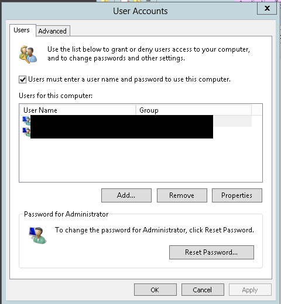

*Superuser [post](http://superuser.com/questions/499724/auto-login-windows-server-2012/661386#661386) by [John Smith](http://superuser.com/users/264417/john-smith)*

# Enable auto-login

I would not manually edit the registry. Use the netplwiz.exe app that comes standard with 2012 (and 2008 as well). This opened the following User Accounts box for me.

Just search for the app through the start menu, or travel to C:\Windows\System32 to find it

---

For the ones as dumb as myself, you need to CLEAR "Users must enter a user name and password to use this computer" and it will ask for a password in which will make the server auto logon. -- *[Francisco Aquino](http://superuser.com/users/78646/francisco-aquino)*