*This is a copy of a [blog post](http://lg.io/2015/07/05/revised-and-much-faster-run-your-own-highend-cloud-gaming-service-on-ec2.html) by Larry Land*

# Revised and much faster, run your own high-end cloud gaming service on EC2!

I’ve written about using EC2 as a gaming rig in the past. After spending some time and getting all sorts of feedback from many people, I’m re-writing the article from before, except with all the latest and greatest optimizations to really make things better. Now we’re using things like NvFBC for graphics card H.264 encoding, using the built-in SSD for better hard drive performance, plus getting rid of things like VNC. I’ve also made the OpenVPN instructions easier to follow.

This is the perfect solution for you fanatics that love to play AAA games but are stuck with one of the new fan-less Macbooks (or similarly slow machines). This is a pretty awesome alternative to building out a new gaming PC. Just make sure you have a good internet connection (ideally 30mbit+ plus <50ms ping to the [closest Amazon datacenter](http://cloudping.info/)). This article will assume you’re on a Mac client, though it should work on Linux or Windows with some minor changes in the client tools.

**TLDR: I have made an AMI for you to use such that you don’t need to go through this lengthy step-by-step. Note you become less of a badass if you use the AMI instead of doing it yourself ;).** [See instructions below](#using-the-pre-made-ami).

## Costs

Believe it or not, it’s actually not that expensive to play games this way. Although you could potentially save moneys by streaming all your games, cost savings isn’t really the primary purpose. Craziness is, of course. :)

+ **$0.11/hr** Spot instance of a g2.2xlarge
+ **$0.41/hr** Streaming 10mbit at $0.09/GB
+ **$0.01/hr** EBS storage for 35GB OS drive ($3.50/mo)

You’re looking at $0.53/hr to play games this way. Not too bad. That’s around 1850 hours of gaming for the cost of a $1000 gaming PC. Note that prices vary for different datacenters.

## Creating your own AMI with the right config

1. <a name="step1"></a>On AWS, create a new EC2 instance. Use defaults everywhere except as mentioned below:

 * Base image should be `Microsoft Windows Server 2012 R2 Base` (since Windows still has all the best games) 
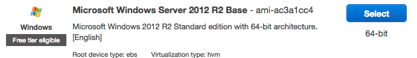
 * Use a `g2.2xlarge` instance (to get an NVIDIA GRID K520 graphics card). Though a larger instance does exist in some regions, I have been unsuccessful in taking advantage of the multiple vGPUs w/ SLI. Plus it’s four times the cost.
 * Use a Spot instance, it’s significantly cheaper (fractions the regular cost) than regular instances. Note cost will vary depending on region. I usually bid a penny more.
 * For the storage step, leave everything at the defaults. This will provision a 35GB EBS drive where your OS will live, and a 65GB SSD-backed instance-store (which is super fast and where the games will go). This instance-store will be available as a `Z:\` drive.
 * For the Security Group, I’d recommend creating one that has 3 rules: one that allows `All TCP`, one that allows `All UDP` and one that allows `All ICMP`. Source should be from Anywhere for all 3. Yes, its not maximum security, but with the VPNs you’ll be setting up, it’ll be very convenient.
Finally, for the Key Pair, create a new one since you’ll need one for Windows (to retrieve the Administrator password later)

2. <a name="step2"></a>Once your machine has spun up, [get the Windows password](https://docs.aws.amazon.com/AmazonCloudFront/latest/DeveloperGuide/IIS4.1GettingPassword.html) using your private key. Connect via [Microsoft Remote Desktop](https://itunes.apple.com/en/app/microsoft-remote-desktop/id715768417?mt=12) and add the details in there. Also make sure to select `Connect to admin session` to avoid GPU detection troubles. Note that your first connection might have a black screen for about a minute as it creates your user profile.

3. Before we go too crazy:
 * [Disable the IE Enhanced Security Configuration](http://www.win2012workstation.com/ie-enhanced-security-configuration/) (so you can use IE)
 * [Enable auto-login](http://superuser.com/a/661386)
 * [Disable the windows firewall](http://www.dell.com/support/article/us/en/19/SLN156432/EN)
 * [Enable showing filename extensions](https://support.software.dell.com/appassure/kb/118327)

4. Download and install version 347.88 of the [GeForce GTX TITAN X driver package](http://www.geforce.com/drivers/results/83080) for Windows 8.1. Only the GeForce package contains the latest drivers for the GRID cards. If you get an error when installing the drivers that says it couldn’t detect a GeForce card, you’re not in Remote Desktop as an `admin session`. Reboot when asked. Note that the latest version of the drivers sometimes cause Windows not to be able to restart. 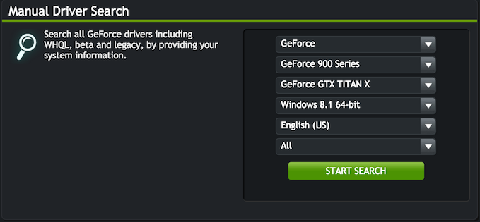

5. The GRID cards have an optimization Steam can use which can offload the H.264 video encoding to the GPU. We need to enable this though. Sign up for a developer account with NVidia and download and extract the [GRID SDK](https://developer.nvidia.com/grid-app-game-streaming). In the bin directory run the following (using a Command Prompt): `NvFBCEnable.exe -enable -noreset`. Reboot again.

6. In order to make games actually use the video card, you’ll need to completely remove the default display driver. Open up Device Manager, and a) disable the `Microsoft Basic Display Adapter`, b) uninstall it and c) run the following in a Command Prompt. Reboot afterwards.

 ```
 takeown /f C:\Windows\System32\Drivers\BasicDisplay.sys
 echo Y | cacls C:\Windows\System32\Drivers\BasicDisplay.sys /G Administrator:F
 del C:\Windows\System32\Drivers\BasicDisplay.sys
 ```
 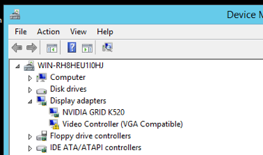
 
7. Start the Windows Audio Service as per the instructions [here](http://www.win2012workstation.com/enable-sound/). As we’re also on an EC2 machine, there is no soundcard, so install [Razer Surround](http://www.razerzone.com/surround) to get a virtual soundcard, AND you get fancy 5.1 simulation! Note that there’s no need to create/login to a Razer ID account.

8. Download OpenVPN from [here](https://openvpn.net/index.php/open-source/downloads.html). Select the 64-bit Vista installer and when installing make sure to select to **select to install all components**. After installing, open a Command Prompt and run the following:

  ```
  cd C:\Program Files\OpenVPN\easy-rsa
  init-config
  vars
  clean-all
  build-ca			(leave all answers blank)
  build-key-server server	(leave all answers blank except Common Name "server", yes to Sign and yes to Commit)
  build-key client		(leave all answers blank except Common Name "client", yes to Sign and yes to Commit)
  build-dh
  robocopy keys ../config ca.crt dh1024.pem server.crt server.key
  ```

 Then:
  1. Download my [server config](Assets/server.ovpn) and place it in the `C:\Program Files\OpenVPN\config` directory.
  2. Use the Microsoft Remote Desktop file sharing feature to download the following files from the `C:\Program Files\OpenVPN\easy-rsa\keys` directory: `ca.crt`, `client.crt`, and `client.key` onto your client computer.
  3. Combine those files along with my [client config](Assets/client.ovpn), [up.sh](Assets/up.sh) and [down.sh](Assets/down.sh). The up and down are used to forward multicast from your client to the server. *Note you’ll need WireShark installed on the mac (with pcap support) in order to make multicast more reliable with the up/down scripts.*
  4. Edit the `client.ovpn` file to have your server’s IP in it.
  5. Install [TunnelBlick](https://code.google.com/p/tunnelblick/) on your Mac. Rename the folder with all the files from above (on your client) to have a `.tblk` extension and double click on it. TunnelBlick will install the VPN.
  6. Finally, start the OpenVPN service on the server (you should also set it to start Automatically), and connect to it from the client. Don’t bother with the OpenVPN GUI stuff.

 *phewf* That was difficult, though you’re pretty badass for getting it done! Note alternatively you can use [ZeroTier](https://www.zerotier.com/) (make sure to enable IP addressing on their website w/ an IP range) and not do any of the above OpenVPN craziness. ;) Also alternatively to ZeroTier is [Hamachi](https://secure.logmein.com/products/hamachi/download.aspx).

9. Create a new file, `C:\startup.bat` which contains `md Z:\SteamLibrary`. The idea is that when the computer boots fresh, it will ensure that the Z drive is initialized properly for Steam to use as a game storage drive. Add this script via `gpedit.msc` to your startup. See instructions [here](http://stackoverflow.com/a/617313). 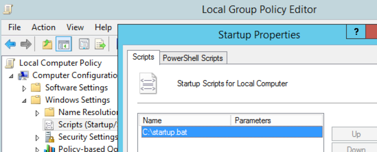

10. <a name="setting-up-steam">[Install Steam](http://store.steampowered.com/about/)</a> and set the following settings:
  * Make it remember your username/password so it can auto-login every time
  * In the Steam preferences, create and add `Z:\SteamLibrary` to your `Downloads > Steam Library Folders`.
  * I recommend you turn off Automatic Sign-in of Friends (since this server will always be logged in) in `Friends`, and turn off the promo dialog in `Interface` (at the bottom).
  * Enable hardware encoding at `In-Home Streaming > Advanced Host Options > Enable Hardware Encoding`
  
     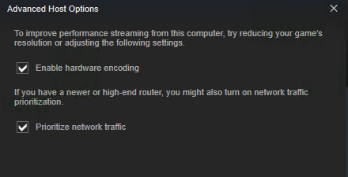

 On your mac, make sure you have Steam installed, but change `In-Home Streaming > Enable Hardware Decoding`. Similar settings to above might also be applicable.

 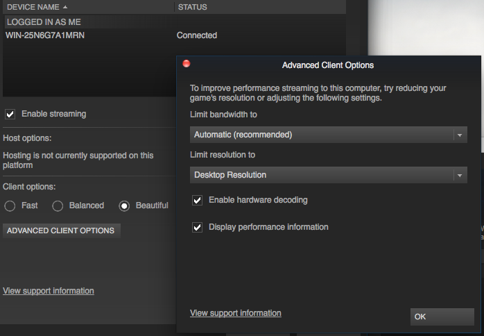
 
11. Once all is set up, run the following to log out of the Remote Desktop session and not lock the screen (so games can start): `tscon %sessionname% /dest:console`. I suggest creating a shortcut on the desktop for this.

 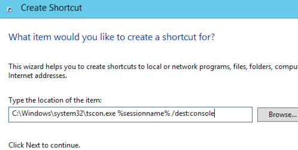
 
## <a name="gaming-time"></a>Gaming time!

1. Make sure the image you created above is ready. I recommend the `gaming-up.sh` and `gaming-down.sh` scripts mentioned below to load/save state via an AMI.

2. With TunnelBlick on your client, connect to the VPN and start Steam on your client. It should detect the remote machine.

 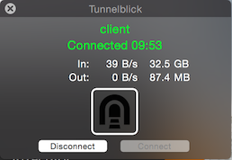
 
 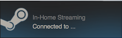

3. Select a game to install (make sure to install to the Z drive), and after installing and click the Stream button!

 *Server*
 
 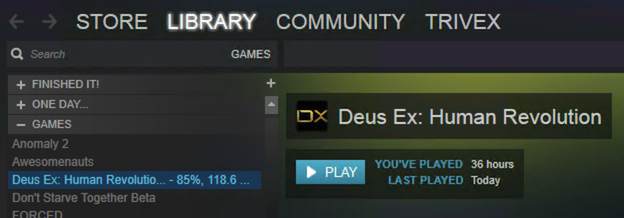

 *Client*
 
 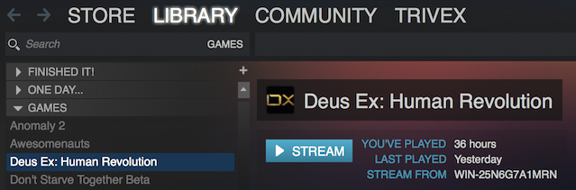

 *Client streaming Deus Ex: Human Revolution*
 
 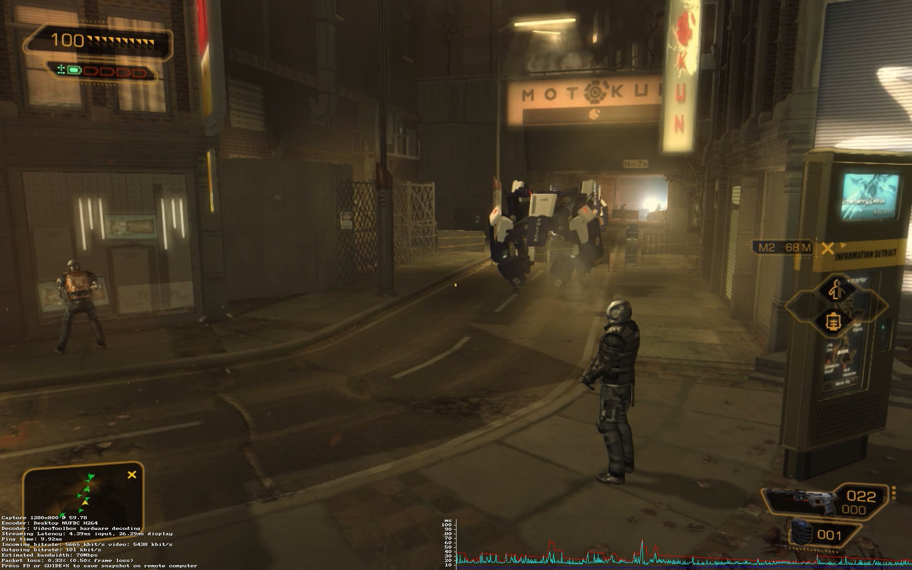

 *Closer view of stats*
 
 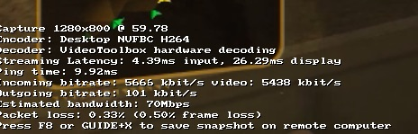

## Further optimizations

* Because these machines have a lot of RAM, i’d suggest setting the Pagefile to something small like 16MB. See how [here](http://blogs.technet.com/b/danstolts/archive/2013/01/07/how_2d00_to_2d00_change_2d00_the_2d00_size_2d00_of_2d00_virtual_2d00_memory_2d00_pagefile_2d00_sys_2d00_on_2d00_windows_2d00_8_2d00_or_2d00_windows_2d00_server_2d00_2012.aspx). The smaller your `C:\` drive, the faster the AMI creation will be.
* Often times games will crash when trying to start. It’s usually because they’re missing certain libraries. Make sure to install [.NET 3.5](https://technet.microsoft.com/en-us/library/dn482071.aspx), [XInput/Xaudio libraries](http://www.win2012workstation.com/xinput-and-xaudio-dlls/), and the Media Foundation feature package (from Server Manager). Also force run Windows Update and apply everything (including Optional packages).
* I wouldn’t suggest attempting to write scripts to backup your `Z:\` drive to `C:\` when shutting down your machine. The games download quite quickly on a fresh boot from Steam. The `C:\` drive and EBS is quite slow.
* To make it easy to start/stop the gaming instance I’ve made [gaming-up.sh](Assets/gaming-up.sh) and [gaming-down.sh](Assets/gaming-down.sh). `gaming-down.sh` will terminate the instance after creating an AMI, and gaming-up.sh will restore this AMI. You’ll need `jq` installed. Thanks to [Matt Marino](https://twitter.com/Ephs05msm), [here](https://www.evernote.com/shard/s467/sh/94042f32-9b11-45f7-a95a-1a653fc5988b/d9a81d9cb608b78e) are instructions for running this on Windows)
* Some games don’t have Steam Cloud. I’d recommend installing [Dropbox](https://www.dropbox.com/) and syncing the My Documents directory with it. That way you won’t lose your save game files between terminations.

## Performance gauging

There are two ways to see how your streaming performance is doing.

1. The first is have the `Display performance information` option enabled in your client’s Steam In-Home Streaming settings. Then when in-game, press F6 (Fn+F6 on a Mac) and information will be displayed at the bottom of the screen.
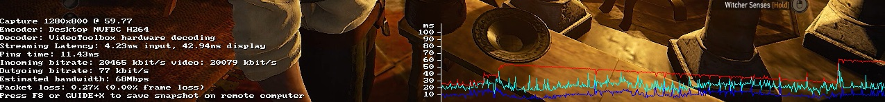

  * Make sure that the Encoder is always NVFBC. If it’s not this will significantly slow things down since the H.264 encoding of the video will be done on the CPU (slower than the hardware H.264 encoding on the GRID GPU). If you see any form of `x264` here, it’s using CPU encoding.
  * Same goes for making sure you’re not doing software decoding. VideoToolbox is good if that’s what you see.
  * The Incoming bitrate will be high, so make sure nobody else is using your internet!
  * Packet Loss needs to be extremely low. Often times MTU problems will bring this up in the double digits, making the game unplayable. Do a Google search for how to fix MTU problems.
  * The graph on the right side is important. The colors basically mean:
     * Dark Blue: amount of time to generate/encode the frame. If this is past 10ms, turn down your game resolution and settings.
     * Light Blue: amount of time to transfer the frame over the network. This will be the crazy one if you don’t have a spectacular connection or one of your roommates decides to start Bittorrent, etc. Try to keep this one as low to the Dark Blue line as possible, but much of it is out of your control.
     * Red: amount of time to decode and display the H.264 video. You can’t do much here except keep the resolution down and make sure hardware decoding is on.

2. The second, more detailed way to look at streaming performance is to press F8 while gaming. Note this will likely crash your Mac Client in the process. An example of the output (found at `C:\Program Files (x86)\Steam\logs\streaming_log.txt` on the server):

 ```
 {
 	"GameNameID"             "The Witcher 3: Wild Hunt"
 	"TimeSubmitted"          "1435438519"
 	"ResolutionX"            "1280"
 	"ResolutionY"            "800"
 	"CaptureDescriptionID"   "Desktop NVFBC H264"
 	"DecoderDescriptionID"   "VideoToolbox hardware decoding"
 	"BandwidthLimit"         "15000"
 	"FramerateLimit"         "0"
 	"SlowGamePercent"        "0"
 	"SlowCapturePercent"     "0"
 	"SlowConvertPercent"     "0"
 	"SlowEncodePercent"      "0"
 	"SlowNetworkPercent"     "0"
 	"SlowDecodePercent"      "0"
 	"SlowDisplayPercent"     "0"
 	"AvgClientBitrate"       "21.21160888671875"
 	"StdDevClientBitrate"    "28.340831756591797"
 	"AvgServerBitrate"       "10105.5224609375"
 	"StdDevServerBitrate"    "0"
 	"AvgLinkBandwidth"       "104074.671875"
 	"AvgPingMS"              "8.4620447158813477"
 	"StdDevPingMS"           "1.4712700843811035"
 	"AvgCaptureMS"           "4.6132941246032715"
 	"StdDevCaptureMS"        "2.260094165802002"
 	"AvgConvertMS"           "0"
 	"StdDevConvertMS"        "0"
 	"AvgEncodeMS"            "4.6132822036743164"
 	"StdDevEncodeMS"         "2.2601768970489502"
 	"AvgNetworkMS"           "6.5326347351074219"
 	"StdDevNetworkMS"        "2.3294456005096436"
 	"AvgDecodeMS"            "2.4401805400848389"
 	"StdDevDecodeMS"         "3.9411675930023193"
 	"AvgDisplayMS"           "6.3233218193054199"
 	"StdDevDisplayMS"        "6.5956048965454102"
 	"AvgFrameMS"             "27.07377815246582"
 	"StdDevFrameMS"          "14.234905242919922"
 	"AvgFPS"                 "60.287784576416016"
 	"StdDevFPS"              "9.2482481002807617"
 	"BigPicture"             "0"
 	"KeyboardMouseInput"     "1"
 	"GameControllerInput"    "0"
 	"SteamControllerInput"   "0"
 }
 ```
 See more information about this file in the [Steam In-Home Streaming](https://steamcommunity.com/groups/homestream/discussions/0/540733523404402134/) Steam Group.
 
## Problems?

* If when you start streaming a game, Steam says the **“Screen is locked”**, you’ll need to make sure you close your Remote Desktop session with `tscon %sessionname% /dest:console`.
* If you can **only see part of the game view**, it’s likely it launched as a window and it’s being improperly cropped by Steam. Make sure your game is in fullscreen mode (usually done in the game’s options).
* If the game is **extremely choppy**, check the Packet Loss percentage by pressing F6. If it’s any higher than 1% or 2% (especially if it’s around 50%), you’re likely having an MTU problem. Try using ZeroTier or Hamachi as the VPN instead of OpenVPN.
* If the **computers can’t see each other**, on your Steam client, go to the InHome Streaming settings and disable and enable streaming. That will send the UDP Multicast packet which should be forwarded over the VPN and get the server to reveal itself. Also, check your VPN connection in general.
* If when you start Steam on your Mac you get a **Streaming error**, follow the instructions [here](https://steamcommunity.com/groups/homestream/discussions/1/613941122749805249/#c617319460801857830) to fix the executable.
* If the game just suddenly **hangs**, Cmd+Tab out of the game, and go back to Steam on the host. Press the “Stream” button to start the game again. This will terminate the current streaming session, and restart one that uses the same remote process. This should resume your game. (Thanks Jérémie Lumbroso!)

## <a name="using-the-pre-made-ami"></a>Using the pre-made AMI

Lets face it, following all of the stuff above is a long, tedious process. Though it’s actually quite interesting how everything works, I’m sure you just want to get on the latest GTA pronto. As such I’ve made an AMI with everything above, including the optimizations.

1. On AWS, create a new EC2 instance. Use the instructions on the [first step](#step1), except select the `ec2gaming` Community AMI. Don’t worry about the Key Pair. 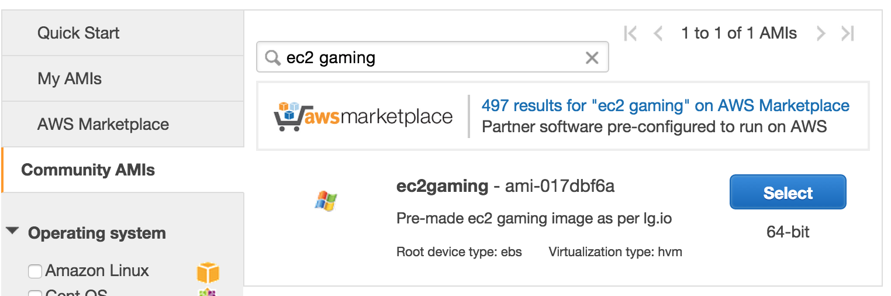

2. Follow [step 2](#step2) except the password for the instance is `rRmbgYum8g`. Once you log in using Microsoft Remote Desktop, you’ll be asked to change the Administrator password. Change it to something. If you’re on Windows, you’ll need to use a Mac or Linux or a mobile client to reset the password since there’s a bug in the Windows Remote Desktop client.

3. Install [TunnelBlick](https://code.google.com/p/tunnelblick/) on your Mac. Download the VPN configuration from [here](Assets/ec2gaming-tblk.zip) and unzip it. In the `client.ovpn` file, change `YOUR_HOSTNAME_HERE` to your instance’s IP/hostname. Rename this folder to `ec2gaming.tblk` and double click on it to import. Connect to the VPN with username `Administrator` and the password you set in the previous step.

4. Set up Steam [as above](#setting-up-steam), though it’s already installed. Just login with your account credentials and configure it accordingly.

5. You should be good to go! Use the `logout` shortcut on the Desktop to log out, and then follow the standard [Gaming Time](#gaming-time) section above.

*Huge thanks for helping me with this goes out to: [@crisg](http://twitter.com/crisg), [@martinmroz](http://twitter.com/martinmroz), Jeff K. from AWS Support, Daniel Unterberger, Clive Blackledge, Matt Marino, and Jérémie Lumbroso*