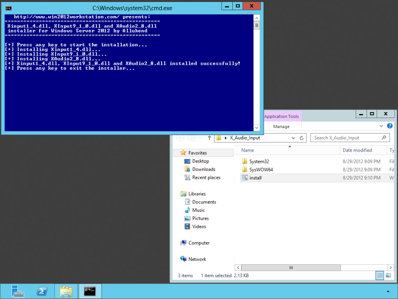

*Copy of a win2012workstation.com [post](http://www.win2012workstation.com/xinput-and-xaudio-dlls/)*

# Install XInput/Xaudio libraries

## Xinput and XAudio Dll’s

For various games and applications from the Windows Store or other sources, you will need to have Xinput1_4.dll, XInput9_1_0.dll and XAudio2_8.dll installed in order to work. If these files are not installed, the applications will crash or just disappear when running them. The files from this package are extracted from a fresh installation of Windows 8 RTM.

1. Download `X_Audio_Input.zip` (313 KB) from [win2012workstation](http://www.win2012workstation.com/wp-content/uploads/2012/08/X_Audio_Input.zip).

2. After downloading the zip extract the zip, run `install.cmd` as an Administrator and follow the instructions on the screen.

   

3. Now run your favorite game or app!