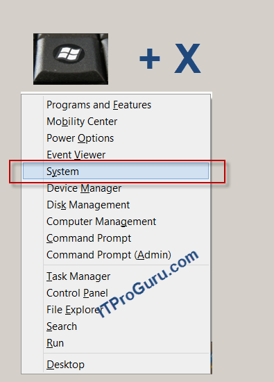
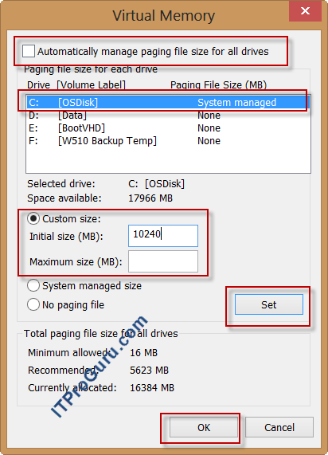

*Copy of a technet.com [article](http://blogs.technet.com/b/danstolts/archive/2013/01/07/how_2d00_to_2d00_change_2d00_the_2d00_size_2d00_of_2d00_virtual_2d00_memory_2d00_pagefile_2d00_sys_2d00_on_2d00_windows_2d00_8_2d00_or_2d00_windows_2d00_server_2d00_2012.aspx)*

# Setting the Pagefile size

## How to Change The Size of Virtual Memory (pagefile.sys) on Windows 8 or Windows Server 2012

1. On the Keyboard Press the `WindowsKey + X` then click `System` in the popup menu

2. Tap or click `Advanced system settings`. Administrator permission required You might be asked for an admin password or to confirm your choice.

3. On the `Advanced tab`, under `Performance`, tap or click `Settings`.

4. Tap or click the `Advanced tab`, and then, under `Virtual memory`, tap or click `Change`.

5. `Clear` the `Automatically manage paging file size for all drives` check box.

6. Under Drive [Volume Label], tap or `click the drive` that contains the paging file you want to change.

7. Tap or click `Custom size`, enter a new size in megabytes in the Initial size (MB) or Maximum size (MB) box, tap or click Set, and then tap or click OK.

**Note**

Increases in size usually don't require a restart for the changes to take effect, but if you decrease the size, you'll need to restart your PC.

