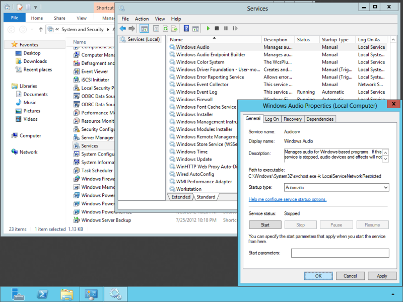

*Copy of a win2012workstation.com [post](http://www.win2012workstation.com/enable-sound/)*

# Start the Windows Audio Service

## Enable Sound

By default, Windows Server 2012 has disabled audio because probably most servers won’t need it. This page will help you to enable audio in Windows Server 2012.

Open the `Start` screen, click `Administrative Tools` and open the `Services` shortcut. Next, double click the `Windows Audio` service and set its `Startup type` to `Automatic`. Repeat this process for the `Windows Audio Endpoint Builder` service. If you want to use audio immediately, also click the `Start` button in the Properties window of both services in addition to changing the Startup type.

